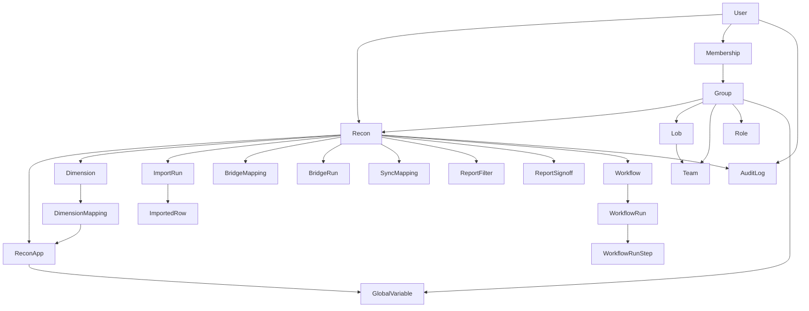

# DART end to end

This is the new DART system in `API_Modal`: FastAPI (`dart_backend`) and the React app (`dart_frontend`). It replaces the old Django + React DART. Use this file to build an ontology. Request bodies for the recon pipeline are in `DART_Recon_Pipeline.md`.

Base URL: `http://127.0.0.1:8000/api/v1`. UI: `http://localhost:3000`.

## What DART is

DART reconciles two or more source systems (ledgers, consolidation tools, ERPs). A user defines a **recon**, maps each source file’s columns onto shared **dimensions**, loads the files, translates source members onto a common **bridge** vocabulary, optionally **transforms** those members, then **runs a report** that compares amounts and shows variance.

The same recon can be replayed by a **workflow** on a schedule.

## Stack

| Piece | Role |
|---|---|
| FastAPI | HTTP API under `/api/v1` |
| PostgreSQL | System of record |
| Redis | Cache and WebSocket fan-out |
| Celery + Redis | Import, bridge, and workflow jobs. `ENVIRONMENT=local` can run the workflow in-process |
| React (TanStack Router) | UI |
| JWT | `Authorization: Bearer` access token. Refresh via `/auth/refresh` |
| File store | Uploaded CSVs under `upload_storage_dir` (local disk) |
| WebSocket | `ws://127.0.0.1:8000/ws/bridge_run:{bridge_run_id}?token={access_token}` |

Errors are always `{ "error": { "code", "message", "request_id" } }`. Lists that need a total send `X-Total-Count`. Pagination query is `page` (default 1) and `page_size` (default 25, max 200).

## Vocabulary (old name → new name)

| Old DART | New DART | Meaning |
|---|---|---|
| Select / recon | `Recon` | One reconciliation definition |
| Recon app / App1, App2 | `ReconApp` | One source system on that recon (1–5) |
| Dimension linking | `Dimension` + `DimensionMapping` | Shared column name and where it sits in each file |
| Run import / file details | `ImportRun` + `ImportedRow` | One uploaded file and its parsed rows |
| Bridge members | `BridgeMapping` | Source member → canonical member, per app and dimension |
| Kickout | bridge member `"kickout"` or an unmapped source member | Excluded from the report until mapped |
| Transformation / sync | `SyncMapping` | Concat or rename of bridged members |
| Run report | computed report | Baseline app amount vs comparison app amount |
| Group / LOB / Team | `Group`, `Lob`, `Team` | Security scopes. LOB is “Department” in the UI |
| Airflow workflow | `Workflow` + `WorkflowRun` | Scheduler that replays the pipeline |
| Log entries | `AuditLog` | Who did what |
| Global variable | `GlobalVariable` | Named catalog value attached to a group and optionally an app |

## Actors

| Actor | What they can do |
|---|---|
| User | Owns recons. Reads and changes recons they own |
| User with `recon:manage_all` | Acts on recons they do not own |
| User with `security:manage` | Creates groups, roles, LOBs, teams, global variables |
| User with `user:manage` | Invites users, sees user audit |
| Superuser | System-wide audit export |
| Platform admin | Turns sidebar modules on and off |

Access to a recon is ownership, `recon:manage_all`, or a linked group the user can manage. A missing recon is **404**, not 403. Soft-deleted recons disappear from lists. Their audit trail remains.

## Ontology

### Identity and security

- **User**: email, username, active flag, user types, superuser, platform admin. Password is never returned.
- **Lob** (Department): named org unit. Has teams.
- **Team**: belongs to one Lob.
- **Group**: named security container. Links to many Lobs, Teams, Roles, Global Variables, and Recons. Created by name only.
- **Role**: named set of privilege strings.
- **Privilege**: a string such as `recon:manage_all`, `security:manage`, `user:manage`.
- **Membership**: one row = user + scope (`lob` | `team` | `group`) + optional role. No role means “belongs”. A role means “holds this role in this scope”.
- **GlobalVariable**: catalog name. A group can link it. A recon app can store `global_variable_id`.
- **SsoProvider**: external login provider. Exchange returns the same token pair as password login.
- **UiComponentSetting**: platform admin hide/show for a sidebar key. Health and auth cannot be switched off.

### Recon (the root business object)

- **Recon**: `name` unique among live rows, `description`, `owner`, `status` (default `Created`), `archived`, `deleted_at`, timestamps.
- Create seeds **App 1**, **App 2**, and mandatory dimensions **YEAR**, **PERIOD**, **AMOUNT**.
- Linking a group is a second call: `POST /recons/{id}/groups/{group_id}`.
- **Copy** clones apps, dimensions, bridge mappings, and sync mappings. It does not copy imported rows or report results.
- **Archive** is `archived=true`. The recon stays. **Delete** sets `deleted_at`.
- At least **2** apps, at most **5**. Deleting an app that would leave fewer than 2 is rejected.

### Dimension linking

- **ReconApp**: `app_number` 1–5, display name, delimiter, header flag, thousands separator, currency symbol, optional global variable.
- **Dimension**: uppercase name, `position`, `is_mandatory`. YEAR, PERIOD, and AMOUNT cannot be deleted.
- **DimensionMapping**: per app, either `in_file` + `column_location`, or not in file + `default_value`. Mappings must include apps 1 and 2.
- CSV import replaces custom dimensions and remaps the mandatory three. Export is positional CSV.

### Run import

- **ImportRun**: one upload for one app. Status `pending | processing | completed | failed`. `je_flag` marks a journal-entry file. History appends; a new upload does not erase older runs.
- **ImportedRow**: `row_number` plus `data` (dimension name → string). `kickout` is written when bridge runs.
- Upload saves the file, creates a pending run, then a worker parses the CSV using the app delimiter and the dimension map.
- Poll `GET /recons/{id}/imports/{import_run_id}` until `completed`.

### Bridge members

- **BridgeMapping**: `(recon, app_number, dimension_name, source_member)` → `bridge_member`. Also `flip_sign`, comments, `is_invalid`.
- **AMOUNT is not a bridge dimension.** It is the measure.
- The literal `kickout` (any case) means “no real mapping”.
- **Default** wipes that app’s mappings and identity-maps every distinct imported value.
- **CSV import** can overwrite or merge. Merge does not update existing keys.
- **BridgeRun**: status `pending | processing | completed | failed`, row counts, `kickout_count`. Applies mappings onto imported rows.
- **Kickout list**: distinct `(app, dimension, source_member)` with no mapping or a kickout mapping, and only after that app has at least one mapping.
- **Resolve** writes a real mapping. **Default kickouts** identity-maps leftovers without wiping good mappings.
- **Bridged data** is computed on read: resolved members, amount, sign-reversed amount, kickout flag.
- A signed-off app cannot change its bridge mappings (409).

### Transformation

- **SyncMapping**: for one app, a list of dimension names, a concat delimiter, `source_sync` → `target_sync`, and `flip_sign`.
- **Apply all** creates identity mappings for every distinct member of those dimensions.
- **Run** (`POST .../sync-data/run`) does not store a result table. It joins bridged values with sync mappings on read.
- Export is CSV of transformed rows.

### Run report

- Compare **baseline app** (default 1) to **comparison app** (default 2).
- Match key = bridged (then transformed) dimension values, excluding kickout rows.
- Amounts apply bridge `flip_sign`, then sync `flip_sign`.
- **Variance** = baseline − comparison. A row is a variance when the absolute difference exceeds `variance_threshold` (default 0).
- **ReportFilter**: named criteria `{ "ENTITY": ["1", "2"] }`. Passed as `filter_id` on run and export.
- **Drill-down**: same report, kept only where `match_key` equals the requested dimension values.
- **ReportSignoff**: per app, signed off or not, by whom, when. Sign-off locks that app’s bridge edits.
- **Last refresh**: latest completed import time for every app on the recon.

### Workflow scheduler

A **Workflow** belongs to one recon. It has a name, a cron (`schedule_cron`), a timezone, `is_paused`, `next_run_at`, and a definition:

- `steps[]`: `key`, `type`, `ignore_kickout`, `kickout_tolerance`, optional `app_number` / `app_name`
- `on_success_emails`, `on_failure_emails`

Step types:

| Type | Does |
|---|---|
| `import_app_data` | Replay that app’s import |
| `import_bridge_data` | Replay that app’s bridge file |
| `upload_dimensions` | Replay the dimension template |
| `run_bridge` | Start a bridge run |
| `check_kickouts` | Stop or continue based on kickout count and tolerance |
| `run_transformation` | Run the transform read |
| `run_report` | Run the variance report |

Default graph for a recon: one `import_app_data` per app, then `run_bridge`, `check_kickouts`, `run_transformation`, `run_report`.

**WorkflowRun** status: `queued | running | succeeded | failed | cancelled`. Trigger: `manual` or `schedule`. Each **WorkflowRunStep** has its own status `pending | running | succeeded | failed | skipped`.

Paused workflows do not get a `next_run_at`. Delete is soft (`deleted_at`).

### Audit and operations

- **AuditLog**: actor, recon, action, entity type/id, detail JSON, time. Views: one recon, “mine”, all users (`user:manage`), system-wide (superuser), CSV export (superuser).
- **AuditMode**: a switch that tags tokens with `audit_status`.
- **SystemLog**: technical and database errors. Not the user-facing audit trail.
- **SsoAuditLog**: SSO provider events.

## End-to-end process (happy path)

1. **Sign in.** `POST /auth/login` with email and password. Keep `access_token`.
2. **Security, if needed.** Create a group. Optionally create a global variable and link it to the group.
3. **Select.** `POST /recons` then `POST /recons/{id}/groups/{group_id}`. Apps 1 and 2 and YEAR/PERIOD/AMOUNT exist.
4. **Dimension linking.** Name the apps. Import a dimension template or add dimensions. Each custom dimension maps apps 1 and 2 to a column or a default.
5. **Run import.** Upload App 1 CSV, poll until `completed`. Upload App 2 CSV, poll until `completed`. Optional `je_flag` for a journal-entry file.
6. **Bridge.** Default-map or import bridge CSVs for each app. Start a bridge run. Poll until `completed`. Resolve or default any kickouts. Bridged data should show `kickout=false` for rows that will hit the report.
7. **Transformation.** Apply-all or create sync mappings. Run transformation. Export if needed.
8. **Report.** Last refresh, run report, drill down, optional filter, export CSV, sign off, then clear sign-off if more bridge edits are required.
9. **Optional.** Copy (Save As), archive, or leave the recon linked to its group.
10. **Optional scheduler.** Create a paused workflow on that `recon_id`, trigger a run, poll until `succeeded`.

Stop before cleanup if the recon should remain on `/recon-pipeline`. Delete is soft.

## UI map

| Screen | Path | Backed by |
|---|---|---|
| Recon Pipeline | `/recon-pipeline` | The six stages above, one recon at a time |
| Manage Users | `/manage-users` | Users, invites, password reset |
| Maintenance | `/maintenance` | Operational maintenance views |
| Manage Recon Security | `/recon-security` | LOB, Team, Group, Role, memberships, global variables |
| Audit Logs | `/audit-logs` | AuditLog views |
| Scheduler — Builder | `/workflow-automation/scheduler/builder` | Edit a workflow graph |
| Scheduler — Workflows | `/workflow-automation/scheduler/workflows` | List, pause, trigger |
| Scheduler — Monitoring | `/workflow-automation/scheduler/monitoring` | Workflow runs |
| Scheduler — Settings | `/workflow-automation/scheduler/settings` | Scheduler settings |
| Ask DART | `/ask-dart` | Help chat surface |
| UI Components | `/platform/ui-components` | Platform admin module switches |

Recon Pipeline stages, in order: **Select → Dimension Linking → Run Import → Bridge Members → Transformation → Run Report.**

## API index

All paths are under `/api/v1`.

| Area | Prefix |
|---|---|
| Health | `/health`, `/health/detailed` |
| Auth | `/auth/login`, `/auth/token`, `/auth/refresh` |
| Current user | `/users/me` |
| Users and invites | `/users`, `/users/invited`, `/users/accept-invite`, `/users/reset-password` |
| Groups | `/groups` and `.../members`, `.../admins`, `.../lobs`, `.../teams`, `.../roles`, `.../global-variables` |
| LOBs, teams, roles | `/lobs`, `/teams`, `/roles` |
| Global variables | `/global-variables` |
| SSO | `/sso` |
| Audit mode | `/audit-mode` |
| UI catalog | `/ui-components` |
| Recons | `/recons`, `/recons/available`, `/recons/directory`, `/recons/{id}`, `/recons/{id}/copy`, `/recons/{id}/groups/{group_id}` |
| Apps | `/recons/{id}/apps` |
| Dimensions | `/recons/{id}/dimensions`, `.../seed-mandatory`, `.../import`, `.../export`, `.../{dimension_id}/reorder` |
| Imports | `/recons/{id}/imports`, `.../data`, `.../export` |
| Bridge | `/recons/{id}/bridge-mappings`, `.../default`, `.../import`, `.../export` |
| Kickouts | `/recons/{id}/bridge-kickouts`, `.../default`, `.../export` |
| Bridge runs and data | `/recons/{id}/bridge-runs`, `/recons/{id}/bridge-data` |
| Sync | `/recons/{id}/sync-mappings`, `.../apply-all`, `.../possible-combinations`, `.../import`, `.../export` |
| Transformed data | `/recons/{id}/sync-data/run`, `.../export` |
| Report | `/recons/{id}/report/run`, `.../export`, `.../drill-down`, `.../last-refresh`, `.../signoff` |
| Report filters | `/recons/{id}/report/filters`, `.../members` |
| Recon audit | `/recons/{id}/audit-logs` |
| Audit | `/audit-logs`, `/audit-logs/mine`, `/audit-logs/users`, `/audit-logs/export` |
| System logs | `/system-logs` |
| Workflows | `/workflows`, `/workflows/{id}/runs` |
| Workflow runs | `/workflow-runs`, `/workflow-runs/{id}` |

## Rules an ontology should enforce

- A live recon name is unique. A soft-deleted name can be reused.
- A recon has 2 to 5 apps. Apps 1 and 2 always exist after create.
- YEAR, PERIOD, and AMOUNT always exist and are not deletable.
- A dimension mapping for `in_file=true` requires `column_location`. `in_file=false` requires `default_value`.
- AMOUNT is a measure, not a bridge key.
- Unmapped or `kickout` members do not enter the variance match set.
- Variance is signed: baseline minus comparison.
- Sign-off on an app blocks bridge mapping writes for that app.
- Copy does not copy imported rows.
- Workflow delete and recon delete are soft.
- Tokens and passwords are not domain objects to store in an ontology graph.

## What this system does not include

- Apache Airflow. Scheduling is `Workflow` plus a clock/Celery beat.
- Excel ingestion on the new import path. Those accept CSV.
- Pivot on Run Report.
- Email delivery for workflow success/failure addresses (the fields exist; sending is not the pipeline itself).

## How to read this with the other file

- **This file** is the ontology: objects, relationships, stages, rules.
- **`DART_Recon_Pipeline.md`** is the call list: method, path, payload, response, and the order 001–132 for one recon from login through cleanup.
